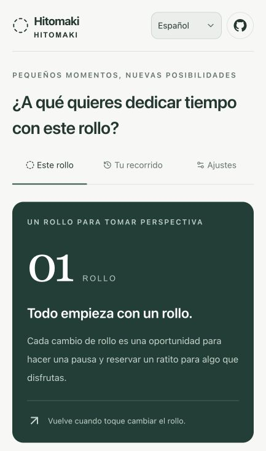

# Hitomaki · Between Rolls（ひと巻き）

[English](README.md) · [日本語](README.ja.md) · [简体中文](README.zh-CN.md) · [한국어](README.ko.md) · [Español](README.es.md)

**La vida también pasa entre un rollo y el siguiente.**

Cambiar un rollo de papel higiénico puede ser una pequeña pausa para mirar el tiempo que ha pasado. Esta aplicación te invita a recordar cómo lo viviste y elegir algo para los próximos días: leer un capítulo, salir a caminar o hablar con alguien que te importa.

[Abrir la aplicación](https://ag3497120.github.io/hitomaki/) · [Participar en las propuestas](https://github.com/Ag3497120/hitomaki/issues)

## La aplicación, de un vistazo



_Pantalla real del primer uso en español, en una vista estrecha y sin registros personales. El formulario para elegir una meta continúa debajo de esta imagen._

| Qué puedes hacer                     | Cómo te acompaña la aplicación                                                                 |
| ------------------------------------ | ---------------------------------------------------------------------------------------------- |
| Elegir una pequeña meta              | Decide algo que te gustaría hacer antes del próximo cambio y reserva un poco de tiempo al día. |
| Notar el tiempo que pasa             | Consulta cuánto tiempo ha transcurrido desde que empezaste el rollo.                           |
| Imaginar una equivalencia en lectura | Ajusta los minutos diarios y por página para explorar lo que sería posible con esos supuestos. |
| Hacer una pausa al cambiar el rollo  | Anota cómo va tu meta, deja una nota breve y elige la siguiente.                               |
| Mirar períodos más largos            | Después del primer rollo, convierte uno, diez y treinta años a tu ritmo observado.             |
| Elegir tu horizonte                  | Abre Life View si te apetece y escoge tú la edad de referencia.                                |
| Volver a tu recorrido                | Revisa metas y notas anteriores o deshaz el último cambio de rollo.                            |
| Usar tu idioma                       | Cambia entre cinco idiomas y visita el repositorio público desde el icono de GitHub.           |

## Cómo funciona

1. Registra cuándo empiezas un rollo y elige una pequeña meta.
2. La pantalla habitual muestra el tiempo transcurrido y, si te interesa, su equivalencia en lectura según tus propios ajustes.
3. Al cambiar el rollo, revisa la meta anterior. Solo después de terminar el primero se abre una escala más amplia: un año, diez años, treinta años.
4. Abre **Life View** únicamente si quieres. Tú eliges la edad de referencia: es un horizonte temporal, no una predicción de cuánto vas a vivir.
5. Elige la siguiente meta y guarda el cambio. Puedes consultar el historial o deshacer el último cambio de rollo.

Disponible en **japonés, inglés, chino simplificado, coreano y español**. El idioma elegido se guarda en este navegador. El idioma no determina tu país ni tus costumbres domésticas. La redacción de cada región sigue abierta a la revisión de personas que conozcan su contexto y hablen la lengua con naturalidad.

## De dónde salen las cifras

El MVP calcula a partir de las fechas de inicio y fin registradas. No presupone que un rollo dure cierto número de días en un país, ni interpreta un rollo compartido como consumo individual.

```text
intervalo medio (días) = suma de los intervalos completos / rollos terminados
rollos por año        = 365,2425 / intervalo medio
rollos en N años      = N × 365,2425 / intervalo medio
páginas equivalentes  = días transcurridos × minutos diarios elegidos / minutos por página elegidos
```

El rollo en uso queda fuera de la media. El primer resultado se identifica como una estimación inicial. A partir de tres rollos completados, la comparación reciente usa los intervalos **completos** de los rollos que terminaron en los últimos 30 días. Se redondea al mostrar los resultados, no durante el cálculo.

Los valores iniciales —10 minutos diarios y 2 minutos por página— son ejemplos editables. No representan lectura realizada, logros ni estadísticas de población. Las cuadrículas de rollos ilustran una escala temporal; no cuentan papel realmente consumido.

Life View multiplica la diferencia entre la edad de referencia y la edad actual en años enteros por 365,2425 días y fija ese horizonte en la fecha de guardado. No utiliza la fecha de nacimiento ni calcula días exactos hasta un cumpleaños. Los rollos restantes se estiman dividiendo los días hasta ese horizonte por el intervalo observado. Abrir la pantalla de nuevo no desplaza la fecha de referencia, y la aplicación no envía avisos de cuenta atrás hacia la muerte.

El tamaño del rollo, compartirlo, viajar o usar varios baños puede cambiar los intervalos observados. Su interpretación sigue en discusión.

## Privacidad y almacenamiento

Las metas, notas, historial, idioma y edad de referencia opcional se guardan en el `localStorage` de este navegador. No hay cuentas, SDK de analítica ni un servidor de la aplicación que reciba estos registros. GitHub Pages distribuye los archivos y puede tratar metadatos habituales de las visitas según sus propias políticas.

- Todavía no hay sincronización entre dispositivos, copias de seguridad ni importación/exportación. Borrar los datos del navegador puede eliminar los registros; el modo privado puede no conservarlos.
- **La versión anterior en chatgpt.site y la de GitHub Pages tienen orígenes distintos: los registros no se trasladan automáticamente.** Conserva el acceso al sitio anterior si necesitas consultar tus datos.
- Otros proyectos del mismo origen `ag3497120.github.io` comparten el límite de seguridad del almacenamiento del navegador. No uses este MVP para guardar información personal sensible.
- El icono de GitHub abre el repositorio en otra pestaña; no envía tu diario a GitHub.

## Decisiones abiertas

| Issue                                                                                     | Tema                                                        |
| ----------------------------------------------------------------------------------------- | ----------------------------------------------------------- |
| [#1 Países, regiones y formatos de rollo](https://github.com/Ag3497120/hitomaki/issues/1) | Longitud, anchura, capas, fuentes e incertidumbre           |
| [#2 Expresiones naturales en cada región](https://github.com/Ag3497120/hitomaki/issues/2) | Tono, vocabulario y revisión local                          |
| [#3 Uso individual o compartido](https://github.com/Ag3497120/hitomaki/issues/3)          | Qué medimos al usar un rollo como reloj                     |
| [#4 Country Profile: Japón](https://github.com/Ag3497120/hitomaki/issues/4)               | Fuentes y preguntas para Japón                              |
| [#5 Country Profile: Estados Unidos](https://github.com/Ag3497120/hitomaki/issues/5)      | Fuentes y preguntas para Estados Unidos                     |
| [#6 Método de normalización](https://github.com/Ag3497120/hitomaki/issues/6)              | Unidades, jerarquía de observaciones, versiones y criterios |

La [política de investigación, en inglés y japonés](docs/research-policy.md), y las plantillas de Issue piden fuentes, supuestos, rangos, grado de certeza y versión. Lo desconocido se mantiene como desconocido. La ficha de un producto no demuestra una media nacional, y una observación del hogar no se convierte automáticamente en una medición personal. Cambiar de modelo después de “cinco rollos” es una hipótesis por evaluar, no una regla implementada.

Puedes participar en cualquiera de los idiomas de la aplicación, indicando país o región e idioma. Un futuro conjunto de datos público necesitará un esquema, un proceso de validación y una licencia compatibles con las fuentes, acordados por separado.

## Desarrollo y publicación

Usa **Node.js 24** (mínimo 22.18) y npm.

```sh
npm ci
npm run dev
npm test
npm run lint
npm run typecheck
npm run build:pages
```

La aplicación usa React 19, TypeScript, Vinext/Vite, Tailwind CSS y Base UI. Abre la dirección local que indique el servidor. La compilación para Pages aplica la ruta `/hitomaki` y reúne solo los archivos estáticos públicos en `out/`.

Para probar esa ruta localmente:

```sh
mkdir -p .preview/hitomaki
cp -R out/. .preview/hitomaki/
python3 -m http.server 4173 --directory .preview
```

Abre `http://localhost:4173/hitomaki/`. El comando separado `npm run build` conserva la compilación original para Sites/Cloudflare Worker; `npm start` ejecuta ese resultado en local. `.openai/hosting.json` pertenece al proyecto original de Sites y no autoriza la publicación en Pages.

[GitHub Actions](.github/workflows/pages.yml) comprueba, compila y publica al enviar cambios a `main` o al ejecutarse manualmente. Las solicitudes de cambios solo ejecutan las comprobaciones. Selecciona GitHub Actions en Settings → Pages; no hace falta una clave secreta de la aplicación. Si cambias el nombre del repositorio o utilizas un dominio propio, actualiza la ruta en `next.config.ts`, el icono en `app/layout.tsx`, la preparación de archivos en `scripts/build-pages.mjs` y los enlaces públicos.

Las comprobaciones automáticas cubren registros, entradas inválidas, deshacer, idiomas alternativos y coherencia de diccionarios, medias, persistencia del horizonte elegido, límites de las cuadrículas y referencias a archivos estáticos. Quedan pendientes la revisión de interacción en navegador, una auditoría de accesibilidad y la revisión por hablantes de cada región.

El símbolo de GitHub procede de [Octicons](https://github.com/primer/octicons) y se utiliza bajo su [licencia MIT](docs/octicons-LICENSE.txt). Cada dependencia conserva su propia licencia.

## Autor y mantenimiento

[Ag3497120](https://github.com/Ag3497120) creó este proyecto y define su dirección, desde la idea de usar un rollo como reloj físico hasta la experiencia en varios idiomas. Puedes proponer mejoras y participar a través de los [Issues](https://github.com/Ag3497120/hitomaki/issues).
