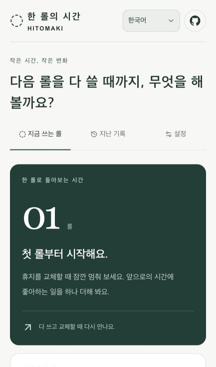

# 한 롤의 시간 · Between Rolls（ひと巻き）

[English](README.md) · [日本語](README.ja.md) · [简体中文](README.zh-CN.md) · [한국어](README.ko.md) · [Español](README.es.md)

**휴지를 갈 때, 지난 시간을 잠깐 돌아보세요.**

휴지 한 롤을 다 쓰는 일은 생활 속에서 자연스럽게 찾아오는 작은 구분점입니다. 이 앱은 그 사이의 시간을 돌아보고, 다음 한 롤 동안 하고 싶은 일을 하나 고를 수 있도록 돕습니다. 책 한 장 읽기, 산책하기, 소중한 사람에게 연락하기처럼 작은 일이어도 좋습니다.

[앱 열기](https://ag3497120.github.io/hitomaki/) · [논의 참여하기](https://github.com/Ag3497120/hitomaki/issues)

## 화면과 주요 기능



_실제 한국어 첫 사용 화면을 좁은 화면에서 촬영했습니다. 개인 기록은 포함하지 않았습니다. 목표 입력란은 이 화면 아래로 이어집니다._

| 할 수 있는 일           | 앱에서 사용하는 방법                                                    |
| ----------------------- | ----------------------------------------------------------------------- |
| 작은 목표 정하기        | 다음 교체 전까지 하고 싶은 일과 하루에 나를 위해 쓸 시간을 정해요.      |
| 흐른 시간 알아차리기    | 지금 쓰는 롤을 시작한 뒤 얼마나 지났는지 확인해요.                      |
| 독서로 바꿔 생각하기    | 하루와 페이지당 시간을 조절해, 그 가정에서 가능한 페이지 수를 살펴봐요. |
| 교체할 때 돌아보기      | 목표의 진행 상황과 짧은 메모를 남기고 다음 목표를 골라요.               |
| 더 긴 시간을 롤로 보기  | 첫 롤을 마친 뒤 기록한 속도로 1년·10년·30년을 살펴봐요.                 |
| 나만의 시간 기준 고르기 | 원할 때만 Life View를 열고 참고할 나이를 직접 정해요.                   |
| 지난 기록 돌아보기      | 예전 목표와 메모를 확인하거나 최근 교체를 되돌릴 수 있어요.             |
| 편한 언어로 사용하기    | 다섯 언어를 전환하고 상단 GitHub 아이콘으로 공개 저장소를 열 수 있어요. |

## 사용 방법

1. 한 롤의 시작 시각을 기록하고 작은 목표를 정합니다.
2. 평소 화면에서는 시작한 뒤 흐른 시간과 직접 설정한 조건에 따른 독서 환산량을 확인합니다.
3. 휴지를 교체할 때 이전 목표를 돌아봅니다. 첫 롤을 마친 뒤에야 1년·10년·30년을 롤로 바라보는 화면이 열립니다.
4. 원할 때만 **Life View**를 열어 기준으로 삼을 나이를 직접 고릅니다. 자신이 정한 시간 범위를 보여 주는 기능이며 수명 예측이 아닙니다.
5. 다음 목표를 정하고 저장합니다. 지난 기록을 보거나 가장 최근의 교체를 되돌릴 수도 있습니다.

**일본어, 영어, 중국어 간체, 한국어, 스페인어**를 지원하며 언어 선택은 이 브라우저에 저장합니다. 언어로 거주 국가나 가족의 생활 습관을 추정하지 않습니다. 지역에 자연스러운 표현인지는 해당 언어와 지역을 잘 아는 사용자의 검토를 통해 계속 개선할 예정입니다.

## 숫자의 의미

현재 버전은 기록된 시작·종료 시각으로 계산합니다. 국가별로 “한 롤은 며칠”이라는 값을 정해 두지 않으며, 함께 쓰는 휴지의 교체 간격을 개인의 소비량으로 해석하지 않습니다.

```text
평균 간격(일) = 완료한 롤들의 사용 구간 일수 합계 ÷ 완료한 롤 수
연간 환산량   = 365.2425 ÷ 평균 간격
N년 환산량    = N × 365.2425 ÷ 평균 간격
독서 환산량   = 경과 일수 × 설정한 하루 독서 시간(분) ÷ 설정한 페이지당 시간(분)
```

사용 중인 롤은 평균에서 제외합니다. 첫 롤의 결과에는 초기 추정임을 표시합니다. 세 롤 이상 완료한 뒤에는 최근 30일 안에 교체를 마친 롤들의 **전체 시작·종료 구간** 평균도 비교합니다. 중간 계산값은 유지하고 화면에 표시할 때 반올림합니다.

초기값인 “하루 10분, 한 페이지 2분”은 수정할 수 있는 예시 가정입니다. 실제 독서 성과나 인구 통계가 아닙니다. 롤 격자 역시 시간 범위를 표현한 모형이며 실제 종이 소비 기록이 아닙니다.

Life View는 “기준 나이 − 현재 정수 나이”에 365.2425일을 곱한 기간을 나이 설정을 저장한 날짜에 고정합니다. 생일을 사용하지 않으므로 생일까지 계산한 정확한 남은 일수가 아닙니다. 그 기준까지의 남은 일수를 관측한 평균 간격으로 나누어 롤 수를 구합니다. 화면을 다시 열 때마다 기준 날짜가 뒤로 밀리지 않으며, 죽음의 카운트다운 알림을 보내지 않습니다.

롤 크기, 가족 공유, 여행, 여러 화장실의 사용은 교체 간격에 영향을 줄 수 있습니다. 이를 어떻게 해석할지는 공개 논의 중입니다.

## 개인정보와 저장

목표·메모·기록·언어·선택한 나이 기준은 현재 브라우저의 `localStorage`에 저장합니다. 계정, 분석SDK, 기록을 받는 앱 서버는 없습니다. 웹 파일을 제공하는 GitHub Pages는 자체 정책에 따라 일반적인 접속 메타데이터를 처리할 수 있습니다.

- 기기 간 동기화, 백업, 가져오기／내보내기는 아직 지원하지 않습니다. 브라우저 데이터를 지우면 기록을 잃을 수 있으며 시크릿 모드에서는 기록이 유지되지 않을 수 있습니다.
- **기존 chatgpt.site판과GitHub Pages판은 저장되는 출처가 달라 기록이 자동으로 옮겨지지 않습니다.** 이전 기록이 필요하면 원래 사이트를 남겨 두세요.
- 같은 `ag3497120.github.io` 출처의 다른 프로젝트는 브라우저 저장소의 보안 경계를 공유합니다. 민감한 개인정보를 보관하는 용도로 사용하지 마세요.
- GitHub 아이콘은 저장소를 새 탭으로 엽니다. 일지를 GitHub로 보내지 않습니다.

## 공개적으로 검토할 주제

| Issue                                                                       | 내용                                  |
| --------------------------------------------------------------------------- | ------------------------------------- |
| [#1 국가·지역과 롤 규격](https://github.com/Ag3497120/hitomaki/issues/1)    | 길이·너비·겹 수·근거·불확실성         |
| [#2 지역에 자연스러운 표현](https://github.com/Ag3497120/hitomaki/issues/2) | 말투, 용어, 해당 언어 사용자의 검토   |
| [#3 개인 전용과 가족 공유](https://github.com/Ag3497120/hitomaki/issues/3)  | 시간의 기준과 개인 소비량의 차이      |
| [#4 일본 Country Profile](https://github.com/Ag3497120/hitomaki/issues/4)   | 일본 생활 환경에 맞는 조사            |
| [#5 미국 Country Profile](https://github.com/Ag3497120/hitomaki/issues/5)   | 미국 생활 환경에 맞는 조사            |
| [#6 환산 방법](https://github.com/Ag3497120/hitomaki/issues/6)              | 단위, 관측 우선순위, 버전과 적용 조건 |

[조사 방침(영어·일본어)](docs/research-policy.md)과 Issue템플릿에 출처·가정·범위·확실성·버전을 적도록 했습니다. 모르는 값은 모르는 상태로 남깁니다. 한 제품의 규격을 국가 전체의 평균으로 보거나 가구 관측값을 개인 실측값으로 바꾸지 않습니다. “다섯 롤 기록 후 개인 모델로 전환”도 검토할 가설이며 구현된 기준이 아닙니다.

지원하는 언어로 의견을 남겨 주세요. 국가·지역과 언어도 함께 적어 주세요. 향후 공개 데이터셋에는 별도로 합의한 구조, 검증 절차, 원자료와 호환되는 이용허락 조건이 필요합니다.

## 개발과 배포

**Node.js 24**(최소 22.18)와 npm을 사용합니다.

```sh
npm ci
npm run dev
npm test
npm run lint
npm run typecheck
npm run build:pages
```

React 19, TypeScript, Vinext/Vite, Tailwind CSS, Base UI로 구성되어 있습니다. 개발 서버가 안내하는 주소로 접속하세요. Pages 빌드는 `/hitomaki` 경로를 적용하고 공개할 정적 파일만 `out/`에 모읍니다.

정적 버전을 로컬에서 확인하려면:

```sh
mkdir -p .preview/hitomaki
cp -R out/. .preview/hitomaki/
python3 -m http.server 4173 --directory .preview
```

`http://localhost:4173/hitomaki/`를 여세요. 별도의 `npm run build`는 기존 Sites/Cloudflare Worker 빌드를 유지하며 `npm start`로 해당 결과를 로컬에서 실행합니다. `.openai/hosting.json`은 기존 Sites 프로젝트 설정으로, Pages 배포 인증에는 사용하지 않습니다.

[GitHub Actions](.github/workflows/pages.yml)는 `main`에 push하거나 수동 실행할 때 검사·빌드·배포합니다. PR에서는 검사만 합니다. 저장소 Settings → Pages에서 GitHub Actions를 선택하며 앱 비밀키는 필요하지 않습니다. 다른 저장소 이름이나 사용자 지정 도메인을 쓰려면 `next.config.ts`의 기본 경로, `app/layout.tsx`의 아이콘 경로, `scripts/build-pages.mjs`의 출력 경로와 공개 링크를 수정해야 합니다.

자동 검사는 기록, 잘못된 입력, 되돌리기, 언어 대체와 사전 일치, 평균, 나이 기준 유지, 격자 상한 및 정적 파일 참조를 확인합니다. 브라우저 조작·접근성 감사·해당 언어 사용자의 검토는 아직 남아 있습니다.

GitHub 마크는 [Octicons](https://github.com/primer/octicons)의 [MIT 라이선스](docs/octicons-LICENSE.txt)에 따라 사용합니다. 각 의존성에는 해당 라이선스가 적용됩니다.
