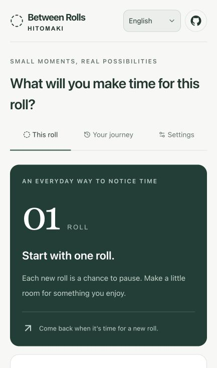

# Between Rolls · ひと巻き

[English](README.md) · [日本語](README.ja.md) · [简体中文](README.zh-CN.md) · [한국어](README.ko.md) · [Español](README.es.md)

**Life happens between rolls.**

A toilet roll is an unexpectedly tangible clock. When you replace one, pause to notice the time that passed, reflect on a small goal, and choose what to carry into the next roll.

[Open the app](https://ag3497120.github.io/hitomaki/) · [日本語 README](README.ja.md) · [Join the discussion](https://github.com/Ag3497120/hitomaki/issues)

## Screens and features



_Actual English first-use screen in a narrow viewport. No personal records are shown. The goal form continues below this view._

| What you can do                 | How the app helps                                                                                |
| ------------------------------- | ------------------------------------------------------------------------------------------------ |
| Start a small goal              | Choose something you want to do before the next roll; set aside a little time each day.          |
| Notice elapsed time             | See how long this roll has been part of your everyday life.                                      |
| Explore a reading equivalent    | Change the minutes per day and per page; the result is a possibility based on those assumptions. |
| Reflect when you replace a roll | Record your goal's progress and a short note, then choose the next goal.                         |
| Open a wider time scale         | After the first completed roll, see one, ten, and thirty years in rolls at the recorded pace.    |
| Choose a personal horizon       | Open the optional Life View and choose a reference age yourself.                                 |
| Revisit your journey            | Browse earlier goals and notes, or undo the latest exchange.                                     |
| Use your preferred language     | Switch among five languages; open the public GitHub repository from the header icon.             |

## How it works

1. Start a roll and choose a small goal: read a chapter, take a walk, or contact someone you care about.
2. Live your life. The everyday screen shows time since the roll started and an optional reading equivalent based on your own settings.
3. On replacement, reflect on the previous goal. Completing the first roll unlocks a wider time scale: one year, ten years, thirty years.
4. Open **Life View** only if you want to. Choose a reference age yourself; this is a time horizon, never a prediction of your lifespan.
5. Choose the next goal and save the exchange. You can revisit your records or undo the last exchange.

Available in **Japanese, English, Simplified Chinese, Korean, and Spanish**. Language selection persists locally. Country-specific wording still needs community and native-speaker review; UI language does not determine a user's country or household habits.

## What the numbers mean

The current MVP uses recorded start and finish timestamps. It does **not** assume a national average number of days per roll or infer an individual's paper consumption from a shared roll.

```text
average interval (days) = sum of completed roll intervals / completed rolls
rolls per year          = 365.2425 / average interval
rolls in N years        = N × 365.2425 / average interval
reading equivalent     = elapsed days × chosen minutes per day / chosen minutes per page
```

Only completed intervals contribute to the roll average. The active roll is excluded. A first-roll estimate is explicitly labeled as preliminary. After at least three completed rolls, the recent comparison uses complete intervals of rolls that finished in the preceding 30 days. Calculations retain precision until display rounding.

The reading defaults (10 minutes per day, 2 minutes per page) are editable examples, **not measured reading, achievements, or population statistics**. The roll grids illustrate a modeled time scale, not a record of paper already used.

Life View anchors `(reference age − current age) × 365.2425` days to the date the user saves their age setting. It uses age in whole years, not a birthday. Its remaining-roll estimate divides the remaining days on that chosen horizon by the recorded average. It does not reset the horizon each time it opens, infer longevity, or send mortality notifications.

Changing roll size, sharing arrangements, travel, and multiple bathrooms can change the observed interval. Their interpretation is an open research question, not a hidden correction factor.

## Privacy and storage

The app saves goals, notes, roll history, language, and the optional age horizon in this browser's `localStorage`. The app has no account system, analytics SDK, or server endpoint for these records. GitHub Pages still serves the files over the network and may process ordinary request metadata under its own policies.

- No cross-device sync, backup, or import/export is implemented yet.
- Clearing browser/site data can erase the records. Private browsing may not preserve them.
- Storage belongs to an **origin**. Records on the earlier `chatgpt.site` version do not automatically appear on `ag3497120.github.io`, and vice versa. Keep the earlier site if you need to consult those records.
- Other projects on the same `ag3497120.github.io` origin share a browser storage boundary. Do not treat this MVP as storage for sensitive personal information.
- The GitHub icon opens this repository in a new tab; it does not send your journal to GitHub.

## Open research

We publish assumptions before adopting country or household models. Contributions can be in English or Japanese; include the language/region for copy suggestions.

| Discussion                                                                                   | Scope                                                                  |
| -------------------------------------------------------------------------------------------- | ---------------------------------------------------------------------- |
| [#1 Country profiles and roll sizes](https://github.com/Ag3497120/hitomaki/issues/1)         | Regional coverage, paper dimensions, ply, sources, uncertainty         |
| [#2 Natural wording by country and language](https://github.com/Ag3497120/hitomaki/issues/2) | Local expression, tone, native-speaker review                          |
| [#3 Individual vs shared rolls](https://github.com/Ag3497120/hitomaki/issues/3)              | What an observation represents; physical clock vs personal consumption |
| [#4 Country Profile: Japan](https://github.com/Ag3497120/hitomaki/issues/4)                  | How should a toilet roll represent time in Japan?                      |
| [#5 Country Profile: United States](https://github.com/Ag3497120/hitomaki/issues/5)          | How should a toilet roll represent time in the US?                     |
| [#6 Normalization methodology](https://github.com/Ag3497120/hitomaki/issues/6)               | Measurement hierarchy, units, versioning, and adoption criteria        |

[Research policy](docs/research-policy.md) explains the proposed profile structure. Issue templates cover country profiles, localization, household modes, and methodology. All country defaults remain **unresearched proposals** until sources, ranges, assumptions, confidence, and versions have been reviewed. A switch after “five rolls” is a discussion example, not an implemented or validated threshold.

## Development

Use **Node.js 24** (minimum 22.18) and npm.

```sh
npm ci
npm run dev
```

Open the local address printed by the development server. The stack is React 19, TypeScript, Vinext/Vite, Tailwind CSS, and Base UI components.

```sh
npm test
npm run lint
npm run typecheck
npm run build:pages
```

The Pages build sets `/hitomaki` as the base path, statically exports the app, and stages only public files in `out/`. To preview the project path locally:

```sh
mkdir -p .preview/hitomaki
cp -R out/. .preview/hitomaki/
python3 -m http.server 4173 --directory .preview
```

Visit `http://localhost:4173/hitomaki/`. The separate `npm run build` command preserves the original Sites/Cloudflare Worker build; `npm start` serves that Worker output locally. The original `.openai/hosting.json` belongs to the original Sites project and is not needed for Pages deployment or authorization.

## Deployment

[Deploy to GitHub Pages](.github/workflows/pages.yml) runs on pushes to `main` and manual dispatch. It installs locked dependencies, runs tests/lint/type checks, builds static output, and deploys `out/` using GitHub's Pages Actions. Pull requests run the same checks without deploying. No application secret is needed.

In repository **Settings → Pages**, select **GitHub Actions**. Forks using a different repository name or a custom domain must update the Pages base path in `next.config.ts`, the icon path in `app/layout.tsx`, the staging path in `scripts/build-pages.mjs`, and the public links. The current deployment targets this repository's `/hitomaki/` path.

## Validation and credits

Automated tests cover roll records, invalid input, undo, language fallback and dictionary parity, averaging, horizon persistence, and bounded visualizations. Static export checks verify referenced local assets. Browser interaction/accessibility audits and native-speaker review remain further work; passing these checks does not establish them.

The GitHub mark comes from [GitHub Octicons](https://github.com/primer/octicons), used under its [MIT license](docs/octicons-LICENSE.txt). Other dependency licenses remain with their respective packages.
